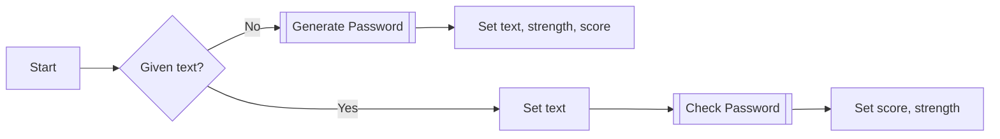
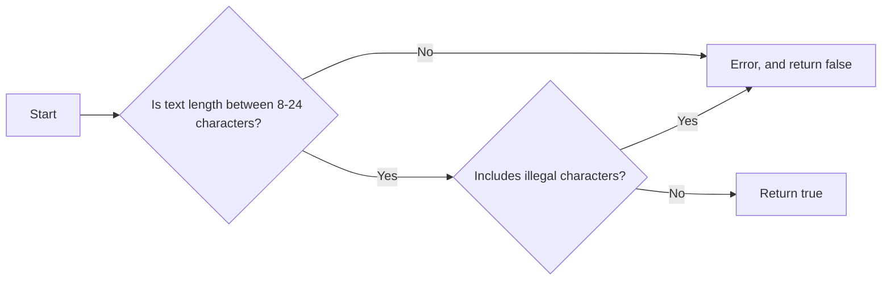

I will not perform flowcharts for every single function, just a couple.

## Password Class

### Constructor

```mermaid
graph LR
    Start[Start] --> Given{Given text?};

    Given -->|No| Generate[[Generate Password]];
    Generate --> Set[Set text, strength, score];

    Given --->|Yes| SetB[Set text];
    SetB --> Check[[Check Password]];
    Check --> SetC[Set score, strength];
```

### Check Input

```mermaid
graph LR
    Start[Start] --> Length{Is text length between 8-24 characters?};

    Length -->|No| Notify[Error, and return false];
    Length --->|Yes| Illegal{Includes illegal characters?};

    Illegal -->|No| Return[Return true];
    Illegal -->|Yes| Notify;
```